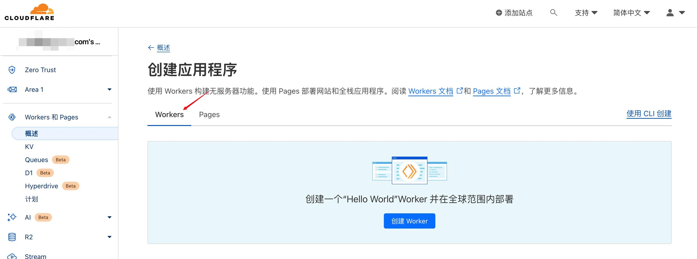

### 1️⃣ 前提条件

只有2个非常简单的条件，没什么难度。

- 有一个Cloudflare账号，免费计划就行
- 有一个域名，并且将DNS解析转到Cloudflare中

### 2️⃣ 搭建步骤

搭建这个服务是使用了Cloudflare的Worker和Pages服务每天可以有10万个免费请求次数这个福利，对于个人使用来说完全不用担心。所以为了你个人安全和不超次数，**请不要分享给别人使用！请不要分享给别人使用！请不要分享给别人使用！**

开始前请先完成上述前提条件，笔者就不赘述了，完全没难度。

**1、打开Workers和Pages**

登录Cloudflare之后，直接点击菜单`Workers和Pages`，进入到概述页面

**2、创建Worker**

点击`创建应用程序`按钮，进入创建页面，切换到`Workers`页签，接着点击页面中的`创建Worker`按钮，进入创建页面。

在创建页面中填写名称，比如就叫`vless-worker`，代码先保持默认不用管，然后点击`部署`按钮，完成创建。

**3、编写Worker**

重点来了。

首先回到概述页面，可以看到我们已经创建好的 Worker，直接点击名称进入 Worker 的主页。

接着点击右上角的`快速编辑`按钮，进入编辑页面，将`Vless`代码粘贴到编辑框中，然后点击右上角的`保存并部署`按钮，完成！**代码比较长，放到文末了**。如果左侧编辑区域加载失败，可以按F12，禁用缓存。

> ⚠️注意：代码中的第7行`userID`，其实就是UUID，默认的值已经被广泛使用了，请一定要修改一下，如果你不知道如何生成UUID，可以到这个网站生成一个：`https://it.huluohu.com/uuid-generator`。

**4、配置自定义域名**

以上其实就已经完成了`Vless`的搭建，但是由于 Cloudflare 自带的Worker域名在国内属于不受欢迎的（你懂的），所以你的域名现在开始出场了，我们需要给这个 Worker 设置一个自定义域名。

首先还是回到到上面创建的 Worker 详情页面，点击`触发器`页签。继续点击`添加自定义域`按钮，开始添加一个自定义域名。

输入你的域名，例如`tiz.yourdomain.com`，并点击`添加自定义域`按钮，完成添加。请注意，输入的域名一定是已经将 DNS 解析添加到 Cloudflare 中的才可以。(可以选择国内域名提供商，然后买完域名之后，将cloudflare的dns替换掉国内的dns，等待刷新就可以。)

至此，Cloudflare中的Worker都已经完成部署和设置了，下面就是如何使用这个`Vless`服务了。

### 3️⃣ 配置客户端

支持`Vless`协议的客户端很多，不同平台也都不大一样，这里笔者就不做任何推荐了，毕竟这玩意也是不受欢迎的。保险起见，笔者截了个图，请参考填写。

**填写说明：**

- 选择协议：选`vless`
- address：填前面设置的自定义域名
- 端口：支持6个https端口可任意选择(443、8443、2053、2083、2087、2096)
- id：就是代码中的 userID，千万不要泄露给其他人
- 选择网络：选`ws`
- host：留空即可
- path：填`/?ed=2048`
- security：选`tls`
- tls servername：同样填前面设置的自定义域名

### 4️⃣ Vless代码

注意：记得更换proxyIp

https://github.com/zizifn/edgetunnel
