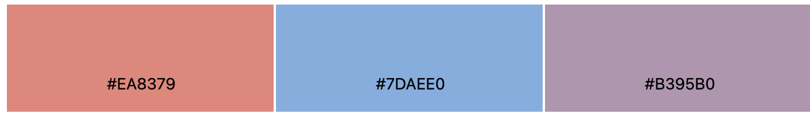
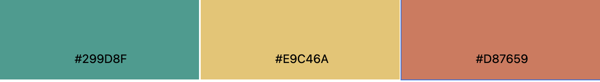
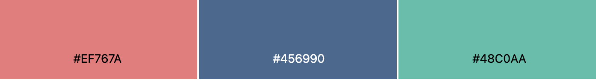

## 1.三色配色

\#EA8379 #7DAEE0 #B395BD

\#299D8F #E9C46A #D87659

\#EF76TA #456990 #48C0AA

## 2.四色配色

\#55B7E6 #193E8F #E53528 #F09739

## 3.六色配色

\#427AB2 #F09148 #FF9896 #DBDB8D #C59D94 #AFC7E8

\#EEA599 #FAC795 #FFE9BE #E3EDEO #ABD3E1 #92B4C8

## 4.多色配色

\#43978F #9EC4BE #ABDOF1 #DCE9F4 #E56F5E #F19685 #F6C957 #FFB77F #FBE8D5

